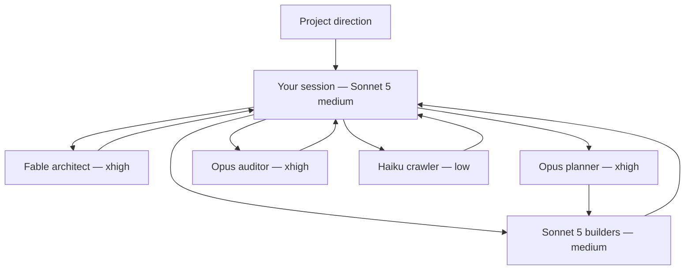

# Underthink

**Put the deep thinking underneath the work.**

Underthink is a Claude Code workflow you run from a Sonnet 5 session at medium
effort. That session becomes the host: it keeps the project in view, routes
decisions, checks evidence, and moves the run forward without trying to be the
smartest model in the room.

When a decision needs more depth, the host sends it down to Fable or Opus.
When the direction is settled, medium-effort Sonnet builders follow the plan
and do the work.

The name is a joke. The split is literal.

## Install

In Claude Code:

```text
/plugin marketplace add Sh-ui/underthink
/plugin install underthink@underthink
```

Start a new session or run `/reload-plugins`. The plugin exposes one command:

```text
/underthink
```

Underthink does not change your model or effort. Set them for the current
session before invoking it:

```text
/model sonnet
/effort medium
/underthink <project direction>
```

The equivalent shell commands are:

```bash
claude plugin marketplace add Sh-ui/underthink
claude plugin install underthink@underthink
```

## What gets put underneath



| Role | What it owns |
| --- | --- |
| Current Sonnet 5 session | Main thread, dispatch, evidence checks, user communication |
| `underthink:architect` | Intent, architecture, invariants, strategic rechecks |
| `underthink:planner` | Dependencies, bounded task packets, gates |
| `underthink:builder` | One settled implementation task and its checks |
| `underthink:auditor` | Independent attempts to disprove completion |
| `underthink:crawler` | One missing fact, with source pointers |

The host and builders do not get `ultrathink`. Architect, planner, and auditor
dispatches do. Hard thinking is spent at the boundaries where it changes the
route, not on every file edit.

## Use

```text
/underthink build the smallest useful version of @notes/brief.md
/underthink CONTEXT.md already settles the design; plan and execute it
/underthink the last builder changed a data boundary; recheck the route
/underthink audit the current diff before I merge it
/underthink resume from the existing roadmap and stop after one verified item
```

For a side-effect-free explanation:

```text
/underthink help
```

## Routing rules

- Existing, explicit atomic task: builder.
- Missing fact: crawler.
- Vague or architecture-bearing direction: architect, then planner.
- Settled work with dependencies or parallelism: planner.
- Architecture breakpoint: architect returns before dependent work continues.
- Completion or integration claim: auditor.
- Product choice: the host asks the user.

The shortest sound route wins. Underthink does not manufacture an architecture
phase when the repository already contains one.

## Session precondition

The plugin does not override Claude Code's default model, effort, or main
agent. Select Sonnet 5 and medium effort in the session where you want to run
Underthink, then invoke `/underthink`.

The skill is written to stop before inspecting the project or dispatching work
when the session is not Sonnet 5 at medium effort. If the session is configured
differently, it asks you to switch rather than silently changing a global or
user setting.

## Safety

Before changing files, the host checks the canonical repository, branch,
worktree, upstream, dirty state, and concurrent work. Builders stop when a task
crosses its scope or needs a missing product or architecture decision.

Underthink does not merge into a primary branch or delete worktrees without
explicit permission. It reports residual risks, unverified claims, dirty state,
and unpushed commits at handoff.

The package contains prompts only. It installs no default agent settings,
hooks, executables, MCP servers, network services, or runtime dependencies.
Claude Code's normal tool permissions still apply.

## Requirements and cost

- Claude Code 2.1.197 or newer.
- Access to Sonnet 5, Fable, Opus, and Haiku.
- A Sonnet 5 session set to medium effort before invoking `/underthink`.

Fable and Opus cost more than a single Sonnet pass. Underthink limits them to
architecture, planning, strategic rechecks, and audits. Routine coordination
and implementation stay on Sonnet 5 at medium effort.

## Update or remove

```bash
claude plugin marketplace update underthink
claude plugin update underthink@underthink
```

```bash
claude plugin uninstall underthink@underthink
claude plugin marketplace remove underthink
```

## Development

```bash
claude --plugin-dir .
claude plugin validate --strict .
```

Evaluation cases live in [`evals/`](evals/).

## License

MIT
